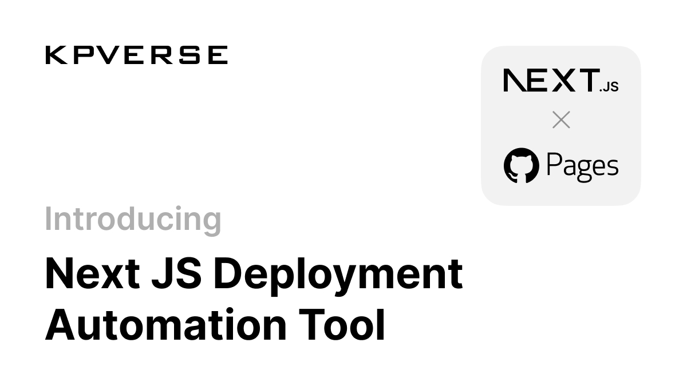

[](https://kpverse.in/deploy-nextjs/ "Next JS Deployment Utility from KPVERSE")

# Deploy Next JS on GitHub Pages with [@kpverse/deploy-nextjs](https://npmjs.com/package/@kpverse/deploy-nextjs)

## What is this for?

[@kpverse/deploy-nextjs](https://npmjs.com/package/@kpverse/deploy-nextjs) is an npm package to simplify the process of deploying Next JS project on GitHub Pages.

## How can this benefit developers?

1.  No need to make Next JS project repository public. Only the deployment repository will b public.
1.  No need to create an account on Vercel or Netlify to host Next JS.
1.  You can use free and open-source CDNs for content delivery. (For more information read [recommended Next JS configuration](#recommended-next-js-configuration).)

## Is this suitable for beginners?

Yes, it is beginner-friendly and streamlines the deployment process for developers of all skill levels.

## Prerequisites

To use [@kpverse/deploy-nextjs](https://npmjs.com/package/@kpverse/deploy-nextjs), your deployment repository must be hosted on GitHub, and GitHub Pages must be enabled.

## Installation

[](https://www.npmjs.com/package/@kpverse/deploy-nextjs)
[](https://bundlephobia.com/package/@kpverse/deploy-nextjs@0.1.0)
[](https://www.npmjs.com/package/@kpverse/deploy-nextjs)

You can install this package using pnpm or npm or yarn:

```bash
npm i @kpverse/deploy-nextjs -D
```

or

```bash
pnpm i @kpverse/deploy-nextjs -D
```

or

```bash
yarn add @kpverse/deploy-nextjs --dev
```

## Quick Start Guide

After installation, simply run the following command to get started:

```bash
npx deploy-nextjs
```

## Configuration Options for [@kpverse/deploy-nextjs](https://npmjs.com/package/@kpverse/deploy-nextjs)

The package generates a `deploy-nextjs.config.js` file upon first use, allowing you to customize your deployment configurations.

## Recommended Next JS Configuration

```js
let GITHUB_USERNAME = "<YOUR_GITHUB_USERNAME>",
    DEPLOYMENT_REPOSITORY_NAME = "<DEPLOYMENT_REPOSITORY_NAME>";

/** @type {import('next').NextConfig} */
const nextConfig = {
    // Read official docs from Next JS: https://nextjs.org/docs/app/api-reference/next-config-js/basePath
    basePath: `/${DEPLOYMENT_REPOSITORY_NAME}`,

    // Read official docs from Next JS: https://nextjs.org/docs/app/api-reference/next-config-js/assetPrefix
    assetPrefix: `https://cdn.jsdelivr.net/gh/${GITHUB_USERNAME}/${DEPLOYMENT_REPOSITORY_NAME}@latest/`,

    // Read official docs from Next JS: https://nextjs.org/docs/app/api-reference/next-config-js/output
    output: "export",

    // Read official docs from Next JS: https://nextjs.org/docs/app/api-reference/next-config-js/trailingSlash
    trailingSlash: true,
};

module.exports = nextConfig;
```

## Support and Issue Reporting

If you need assistance or want to report any issues, please visit [issues tab](https://github.com/kpverse/deploy-nextjs/issues) of our GitHub repository.

## Contributing

This package is open-source, and we welcome contributions from the community. You can contribute to it on [GitHub](https://github.com/kpverse/deploy-nextjs).

## Commercial Use

[@kpverse/deploy-nextjs](https://npmjs.com/package/@kpverse/deploy-nextjs) is licensed under [the MIT License](./LICENSE). Refer to the [license](./LICENSE) for usage and permissions.

<!-- ## Additional Resources

For a more in-depth understanding, check out our [YouTube video](). -->

---

<div align="center"><a href="https://kpverse.in/"></a></div>
